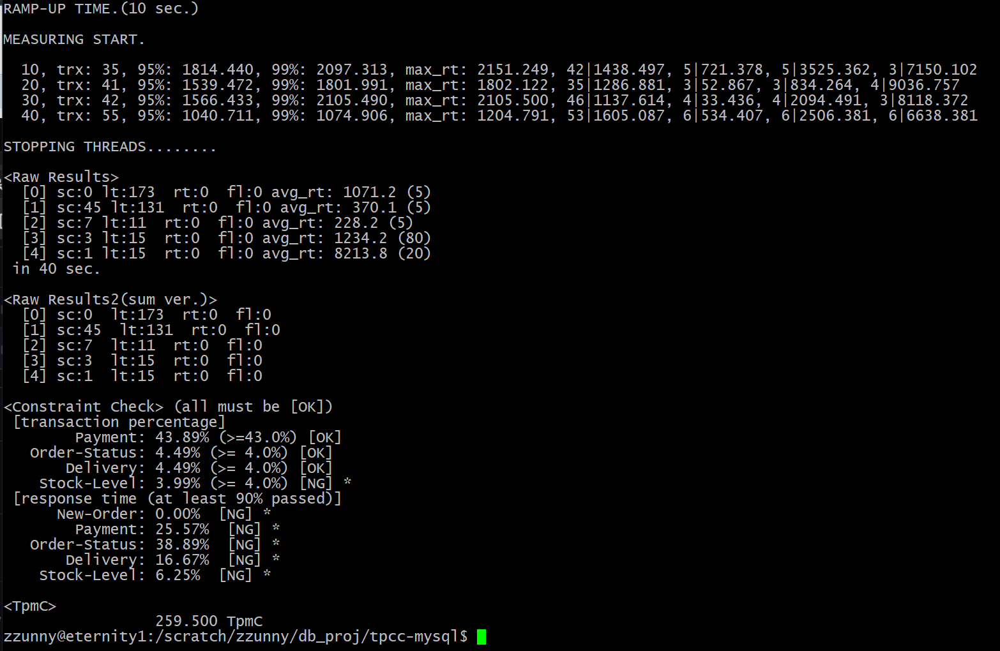

# tpcc 벤치마크 설치 및 실행

### 필요한 패키지 설치
``` bash
$ sudo apt-get install libmysqlclient-dev
```

### tpcc-mysql 다운로드 및 빌드
``` bash
$ git clone https://github.com/Percona-Lab/tpcc-mysql.git

$ cd tpcc-mysql/src
$ make
```

### tpcc 벤치마크 실행 전 설정
``` bash
$ ./bin/mysql -u root -p -e "CREATE DATABASE tpcc;"
$ ./bin/mysql -u root -p tpcc < /path/to/tpcc-mysql/create_table.sql
$ ./bin/mysql -u root -p tpcc < /path/to/tpcc-mysql/add_fkey_idx.sql
```

### tpcc 데이터 로드
``` bash
$ cd tpcc-mysql
$ ./tpcc_load -h 127.0.0.1 -d tpcc -u root -p "yourPassword" -w 20
*************************************
*** TPCC-mysql Data Loader        ***
*************************************
option h with value '127.0.0.1'
option d with value 'tpcc'
option u with value 'root'
option p with value 'yourPassword'
option w with value '20'
<Parameters>
     [server]: 127.0.0.1
     [port]: 3306
     [DBname]: tpcc
       [user]: root
       [pass]: 1234
  [warehouse]: 20
TPCC Data Load Started...
Loading Item
.................................................. 5000
.................................................. 10000
.................................................. 15000
...
...DATA LOADING COMPLETED SUCCESSFULLY.
```

### tpcc 실행
``` bash
$ ./tpcc_start -h 127.0.0.1 -S /tmp/mysql.sock -d tpcc -u root -p "yourPassword" -w 20 -c 8 -r 10 -l 1200 | tee tpcc-result.txt
```


### 실행결과

