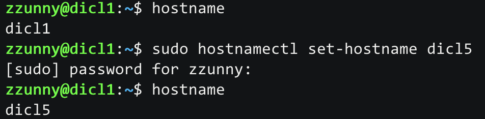

# HostName 설정 즉시반영

### 개요
분산클러스터를 만들다보면 hostname을 변경할 일이 종종 생기곤 하는데, 지금까지는 /etc/hostname에서 직접 파일을 수정했었다.

/etc 아래 있는 파일을 그대로 overwrite를 하는거라서 조금 불안했었는데, 이제는 그냥 커맨드를 이용해서 설정하면 될 것 같다.


### Command
``` bash
$ hostname
dicl1

$ sudo hostnamectl set-hostname dicl5

$ hostname
dicl5
```

### Done
직접 실행한 캡처는 다음과 같다.
